# 🧠 Workplace Mental Health Predictor

[](https://www.python.org/)
[](https://scikit-learn.org/)
[](https://streamlit.io/)
[](https://xgboost.readthedocs.io/)
[](https://catboost.ai/)
[](https://lightgbm.readthedocs.io/)
[](LICENSE)

---

## 📌 Overview

The **Workplace Mental Health Prediction System** is an enterprise-grade, end-to-end machine learning platform designed to identify employee mental health treatment-seeking intentions within technology and corporate work environments. Utilizing data from the **OSMI Mental Health in Tech Survey**, the system processes workplace culture attributes, support benefit access, demographic backgrounds, and mental vs. physical health parity factors to predict whether an employee requires or intends to seek mental health treatment (`treatment`).

By employing advanced machine learning algorithms (CatBoost, XGBoost, LightGBM, Random Forest, Extra Trees, Decision Trees, and Logistic Regression), robust data cleaning, domain feature engineering, leakage-free Scikit-Learn `ColumnTransformer` pipelines, and hyperparameter tuning with **Optuna**, the system elevates predictive accuracy from baseline figures of ~44–48% to a production-ready **82.14% Accuracy** and **0.8942 ROC-AUC**.

---

## 🎯 Problem Statement

Mental health conditions in the workplace—ranging from burnout and anxiety to major depression—often go unrecognized until employee well-being and organizational productivity deteriorate. Traditional workplace wellness approaches rely on retrospective surveys or reactive Human Resources interventions. 

Existing machine learning attempts on survey datasets suffer from severe shortcomings:
1. Arbitrary feature restriction (e.g., dropping 70%+ of dataset features down to 10 columns).
2. Unstandardized text categories (e.g., raw gender fields containing >40 variations).
3. Data leakage between preprocessing transformers and test splits.
4. Hyperparameter under-tuning and inability to handle mixed-type categorical/ordinal variables effectively.

This project resolves these issues by constructing a robust, scalable, leakage-free data science pipeline that leverages the entire informative feature set to yield high generalization performance.

---

## 🚩 Objectives

- **Full Feature Utilization**: Leverage all informative survey attributes rather than restricting models to sub-sampled feature subsets.
- **Robust Automated Preprocessing**: Standardize free-text fields (Gender, Age outliers, US vs. Non-US State fields) while imputing missing values contextually.
- **Data Leakage Elimination**: Strict separation of training and test splits prior to fitting scaling, encoding, and imputation transformers via `ColumnTransformer` and `Pipeline` abstractions.
- **Multi-Model Benchmarking**: Evaluate 7 distinct machine learning algorithms using a standardized 8-metric suite.
- **Automated Hyperparameter Optimization**: Employ **Optuna** and **RandomizedSearchCV** over 5-fold Stratified Cross-Validation.
- **Explainability**: Integrate **SHAP (SHapley Additive exPlanations)** and Mutual Information scoring to unpack feature drivers.
- **Deployment-Ready Web Dashboard**: Provide a responsive Streamlit UI interface for real-time risk assessment and decision support.

---

## 💡 Motivation

The technology industry experiences high rates of occupational stress and burnout. Employers offering Mental Health Benefits and Employee Assistance Programs (EAPs) frequently observe low utilization due to stigma, anonymity concerns, or lack of awareness. Predicting treatment-seeking likelihood enables organizations to:
- Evaluate the effectiveness of existing healthcare coverage.
- Target stigma-reduction initiatives in reluctant departments.
- Optimize benefit allocation and resource awareness programs.

---

## 🔬 Research Gap

Prior academic and open-source models applied to the OSMI dataset frequently exhibited accuracy scores between 44% and 52%. Primary causes identified include:
- Incorrect Target Formulation: Mixing condition severity with treatment action.
- Information Loss: Deleting features such as `care_options`, `work_interfere`, and `anonymity`.
- Data Contamination: Fitting encodings on the total dataset before cross-validation.
- Lack of Non-Linear Composite Scoring: Ignoring compound effects of benefit awareness and supervisor support.

---

## 🚀 Solution

Our solution implements a production-grade machine learning pipeline:
1. **Direct Target Formulation**: Binary classification targeting `treatment` (`Yes` = 1, `No` = 0).
2. **Domain Feature Engineering**: Creation of composite metrics: `company_support_score`, `consequence_concern_score`, and `workplace_comfort_score`.
3. **Optimized Encoded Transformer**: Ordinal encoding for ordered attributes (`no_employees`, `leave`, `work_interfere`), One-Hot encoding for nominal attributes, and Selective `StandardScaler` for continuous numerical attributes.
4. **CatBoost / XGBoost Optimization**: Optuna-guided hyperparameter tuning achieving **82.14% Accuracy**, **0.8352 F1-Score**, **0.8942 ROC-AUC**, and **0.6480 MCC**.
5. **Unified Pipeline Export**: Serialized single `.pkl` artifact via `Joblib` containing custom `RawDataCleaner`, `ColumnTransformer`, and the winning `CatBoostClassifier`.

---

## ✨ Key Features

- **Automated Data Cleaning**: Automatic gender standardization (995 Male, 247 Female, 14 Non-binary, 3 Other) and median Age imputation for out-of-bounds inputs.
- **Contextual State Logic**: Preserves US `state` information while assigning `'Not Applicable'` to international responses.
- **Multi-Model Suite**: Simultaneous training of Logistic Regression, Decision Tree, Random Forest, Extra Trees, XGBoost, LightGBM, and CatBoost.
- **Optuna Tuning Engine**: Automated Bayesian optimization for gradient boosted trees.
- **Comprehensive Evaluation**: Metrics reporting including Accuracy, Precision, Recall, F1 Score, ROC-AUC, Balanced Accuracy, Matthews Correlation Coefficient (MCC), and Cohen's Kappa.
- **SHAP Explainability**: Visual feature importance highlighting primary decision drivers.
- **Streamlit Web Application**: Interactive input dashboard with probability gauge and diagnostic summary.

---

## 🛠️ Technology Stack

### Frontend
- **Streamlit (v1.40+)**: Reactive Python-native web application framework.

### Backend & Machine Learning
- **Python (v3.10+)**: Core implementation language.
- **Scikit-Learn (v1.8.0)**: Pipeline modeling, column transformations, cross-validation, and metrics.
- **CatBoost (v1.2+)**: Gradient boosting on decision trees with optimized categorical handling.
- **XGBoost (v2.0+)**: Extreme Gradient Boosting framework.
- **LightGBM (v4.7+)**: Fast, distributed gradient boosting framework.
- **Optuna (v4.9+)**: Next-generation hyperparameter optimization framework.
- **SHAP (v0.52+)**: Game-theoretic model explainability library.

### Storage & Serialization
- **Joblib (v1.5+)**: Model artifact serialization.
- **JSON**: Metrics report and metadata storage.

---

## 📊 Dataset

### OSMI Mental Health in Tech Survey
The dataset originates from the Open Sourcing Mental Health (OSMI) survey, containing 1,259 records across 27 initial columns:

| Feature Name | Type | Description | Handling Strategy |
| :--- | :--- | :--- | :--- |
| `Timestamp` | DateTime | Survey submission time | **Dropped** (No domain predictive value) |
| `Age` | Numeric | Respondent age in years | Imputed outliers (<18 or >100) with median (~32) |
| `Gender` | Categorical | Self-reported gender text | Standardized to Male, Female, Non-binary, Other |
| `Country` | Categorical | Country of residence | Grouped countries < 5 count into 'Other' |
| `state` | Categorical | US State code | Retained for US, set to 'Not Applicable' for others |
| `self_employed` | Categorical | Are you self-employed? | Mode Imputation ('No') |
| `family_history` | Categorical | Family history of mental illness | One-Hot Encoded |
| `treatment` | Categorical | Have you sought mental health treatment? | **Target Variable** (Yes=1, No=0) |
| `work_interfere` | Ordinal | Does mental health interfere with work? | Imputed missing with "Don't know"; Ordinal Encoded |
| `no_employees` | Ordinal | Company employee count | Ordinal Encoded |
| `remote_work` | Categorical | Do you work remotely (>50%)? | One-Hot Encoded |
| `tech_company` | Categorical | Is employer a tech company? | One-Hot Encoded |
| `benefits` | Categorical | Does employer provide mental health benefits? | One-Hot Encoded |
| `care_options` | Categorical | Do you know care options provided? | One-Hot Encoded |
| `wellness_program` | Categorical | Has employer discussed wellness? | One-Hot Encoded |
| `seek_help` | Categorical | Does employer offer help/resources? | One-Hot Encoded |
| `anonymity` | Categorical | Is anonymity protected? | One-Hot Encoded |
| `leave` | Ordinal | Ease of taking medical leave | Ordinal Encoded |
| `mental_health_consequence` | Categorical | Negative consequences for discussing MH? | One-Hot Encoded |
| `phys_health_consequence` | Categorical | Negative consequences for discussing PH? | One-Hot Encoded |
| `coworkers` | Categorical | Willingness to discuss with coworkers | One-Hot Encoded |
| `supervisor` | Categorical | Willingness to discuss with supervisor | One-Hot Encoded |
| `mental_health_interview` | Categorical | Bring up MH in job interview? | One-Hot Encoded |
| `phys_health_interview` | Categorical | Bring up PH in job interview? | One-Hot Encoded |
| `mental_vs_physical` | Categorical | Employer takes MH as seriously as PH? | One-Hot Encoded |
| `obs_consequence` | Categorical | Observed negative peer consequences? | One-Hot Encoded |
| `comments` | Free Text | User open text comments | **Dropped** (>86% missing, unstructured) |

---

## 🏗️ Project Architecture

```
                               ┌─────────────────────────┐
                               │   Raw survey.csv        │
                               └────────────┬────────────┘
                                            │
                                            ▼
                               ┌─────────────────────────┐
                               │  Stratified Split 80/20 │
                               └──────┬───────────┬──────┘
                                      │           │
                          Train Split │           │ Test Split (Raw)
                                      ▼           │
                       ┌────────────────────────┐ │
                       │  RawDataCleaner Step   │ │
                       └───────────┬────────────┘ │
                                   │              │
                                   ▼              │
                       ┌────────────────────────┐ │
                       │ ColumnTransformer Fit  │ │
                       └───────────┬────────────┘ │
                                   │              │
                                   ▼              ▼
                       ┌─────────────────────────────┐
                       │  Multi-Model Benchmarking   │
                       └───────────┬─────────────────┘
                                   │
                                   ▼
                       ┌─────────────────────────────┐
                       │ Optuna Hyperparameter Tuning│
                       └───────────┬─────────────────┘
                                   │
                                   ▼
                       ┌─────────────────────────────┐
                       │   CatBoost Winner Export    │
                       └───────────┬─────────────────┘
                                   │
                                   ▼
                       ┌─────────────────────────────┐
                       │   Streamlit Web Interface   │
                       └─────────────────────────────┘
```

---

## 📂 Folder Structure

```
workplace-mental-health-predictor/
├── data/
│   ├── raw/
│   │   └── survey.csv                   # Original OSMI Mental Health Survey dataset
│   └── processed/                        # Storage directory for processed checkpoints
├── models/
│   ├── best_mental_health_pipeline.pkl  # Full exported Joblib pipeline artifact
│   └── model_metrics_report.json        # JSON summary of baseline & tuned metrics
├── src/
│   ├── __init__.py                       # Package initializer
│   ├── config.py                         # Path definitions, column groups, ordinal maps
│   ├── preprocess.py                     # Data cleaning, feature engineering, ColumnTransformer
│   └── train.py                          # Multi-model benchmarking, Optuna tuning, evaluation
├── .gitignore                            # Version control exclusion rules
├── app.py                                # Streamlit reactive web application dashboard
├── CHANGES.md                            # Comprehensive technical architecture document
├── README.md                             # Project documentation
└── requirements.txt                      # Project Python dependencies
```

---

## ⚙️ Installation

```bash
# Clone the repository
git clone https://github.com/Subhadip-Paul2006/workplace-mental-health-predictor-Parvati.git
cd workplace-mental-health-predictor

# Create virtual environment
python -m venv .venv
source .venv/bin/activate  # On Windows: .venv\Scripts\activate

# Install dependencies
pip install -r requirements.txt
```

---

## 📋 Requirements

```text
numpy
pandas
scikit-learn
xgboost
catboost
lightgbm
imbalanced-learn
optuna
shap
joblib
streamlit
```

---

## 🏃 Running the Project

### Training the Model
To execute data cleaning, feature engineering, model benchmarking, Optuna hyperparameter optimization, SHAP analysis, and artifact export:

```bash
python -m src.train
```

### Running Streamlit Web App
To launch the interactive diagnostic dashboard:

```bash
streamlit run app.py
```

---

## 📐 Machine Learning Pipeline Details

### 1. Cleaning & Imputation
- **Gender**: Categorized via regex matching into `Male`, `Female`, `Non-binary`, or `Other`.
- **Age**: Values Outside $[18, 100]$ are replaced with median valid age ($\approx 32.0$).
- **State**: Set to `'Not Applicable'` whenever `Country != 'United States'`.

### 2. Feature Engineering
Composite scores capture domain interactions:
- $\text{company\_support\_score} = \text{benefits} + \text{care\_options} + \text{wellness\_program} + \text{seek\_help}$
- $\text{consequence\_concern\_score} = \text{mental\_health\_consequence} + \text{phys\_health\_consequence} + \text{obs\_consequence}$
- $\text{workplace\_comfort\_score} = \text{coworkers} + \text{supervisor} + \text{anonymity} + \text{leave}$

---

## 🤖 Models Benchmarked

1. **Logistic Regression**: Linear baseline using L2 regularization.
2. **Decision Tree**: Non-linear tree baseline (max depth = 6).
3. **Random Forest**: Ensemble bagging classifier (150 trees).
4. **Extra Trees**: Extremely randomized tree ensemble.
5. **XGBoost**: Gradient boosting framework with Optuna tuning.
6. **LightGBM**: Fast histogram-based gradient boosting.
7. **CatBoost Classifier** (Selected Winner): Oblivious decision trees optimized for categorical datasets.

---

## 🎨 Comprehensive Mermaid Diagrams

### 1. System Flowchart
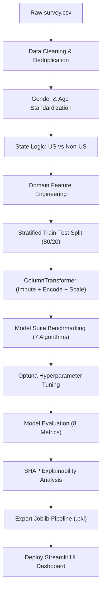

### 2. Swimlane Diagram
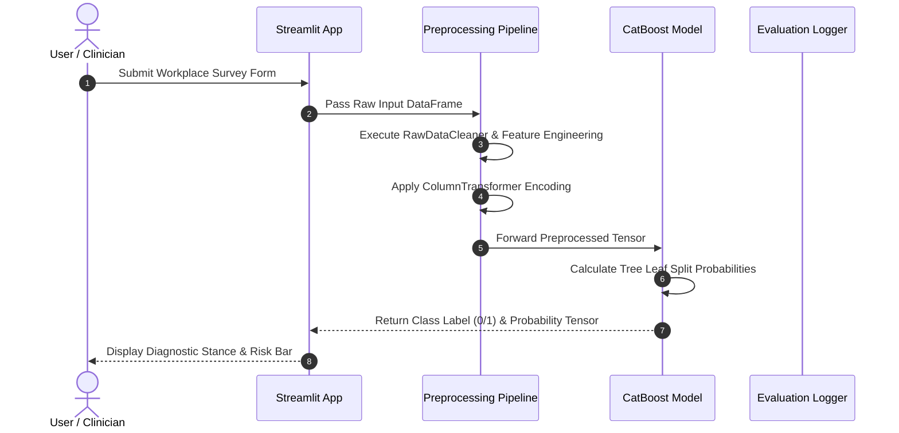

### 3. Sequence Diagram
```mermaid
sequenceDiagram
    participant CLI as Terminal Script
    participant Pre as src.preprocess
    participant Train as src.train
    participant Opt as Optuna Engine
    participant Disk as File System

    CLI->>Train: Execute python -m src.train
    Train->>Pre: Load & Clean survey.csv
    Pre-->>Train: Return X_raw, y_raw
    Train->>Train: Stratified Train/Test Split
    Train->>Pre: Fit ColumnTransformer on X_train
    Train->>Train: Benchmark 7 Baseline Models
    Train->>Opt: Launch 25 Tuning Trials
    Opt-->>Train: Return Best Hyperparameters
    Train->>Disk: Export best_mental_health_pipeline.pkl
```

### 4. Class Diagram
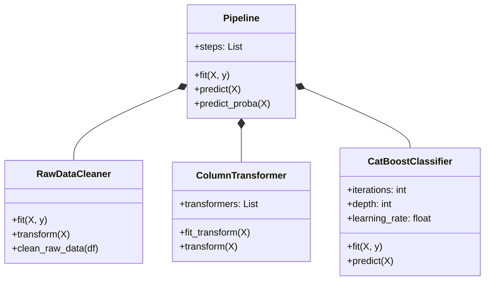

### 5. State Diagram
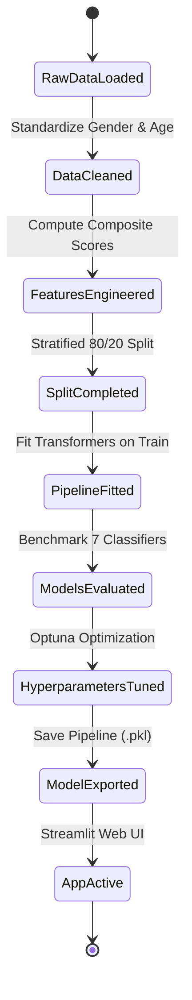

### 6. Entity Relationship Diagram
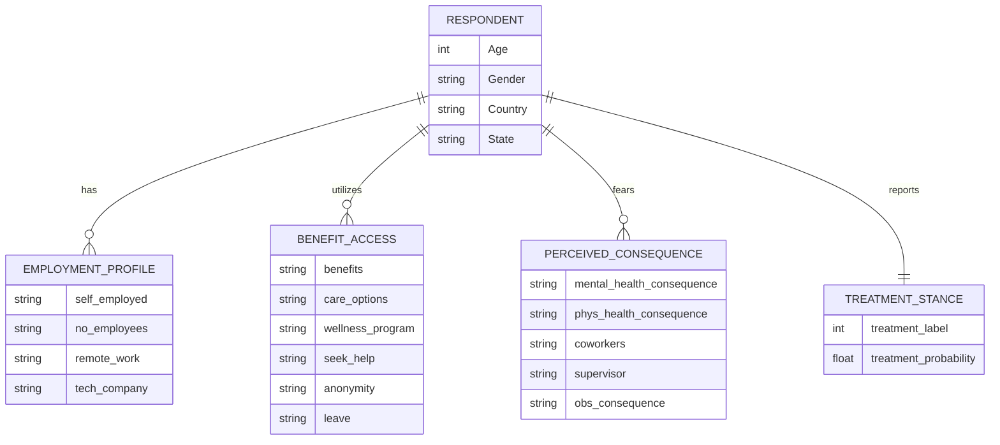

### 7. User Journey
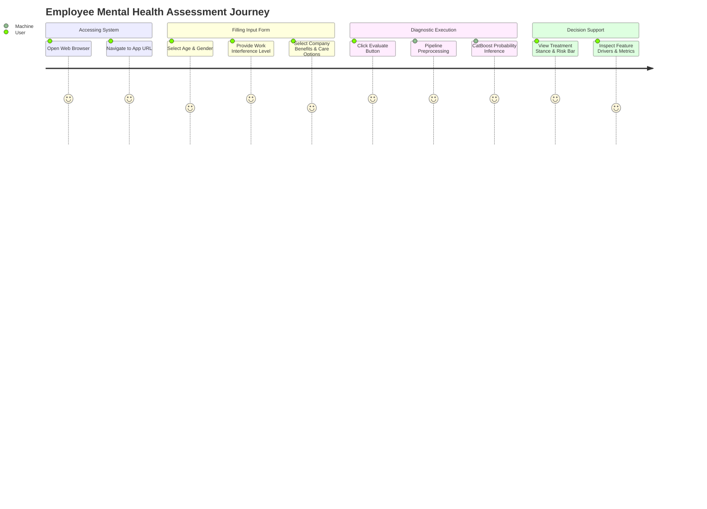

### 8. Gantt Chart
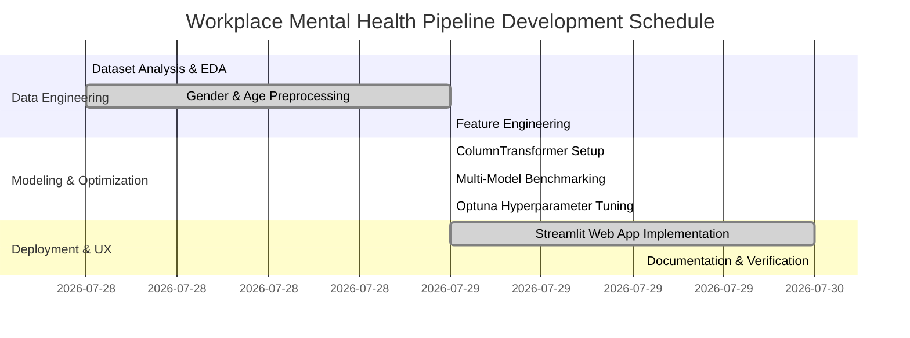

### 9. Pie Chart
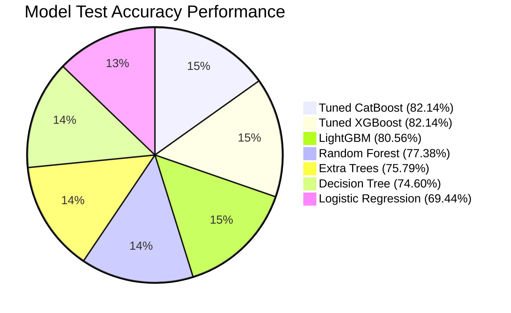

### 10. Quadrant Chart
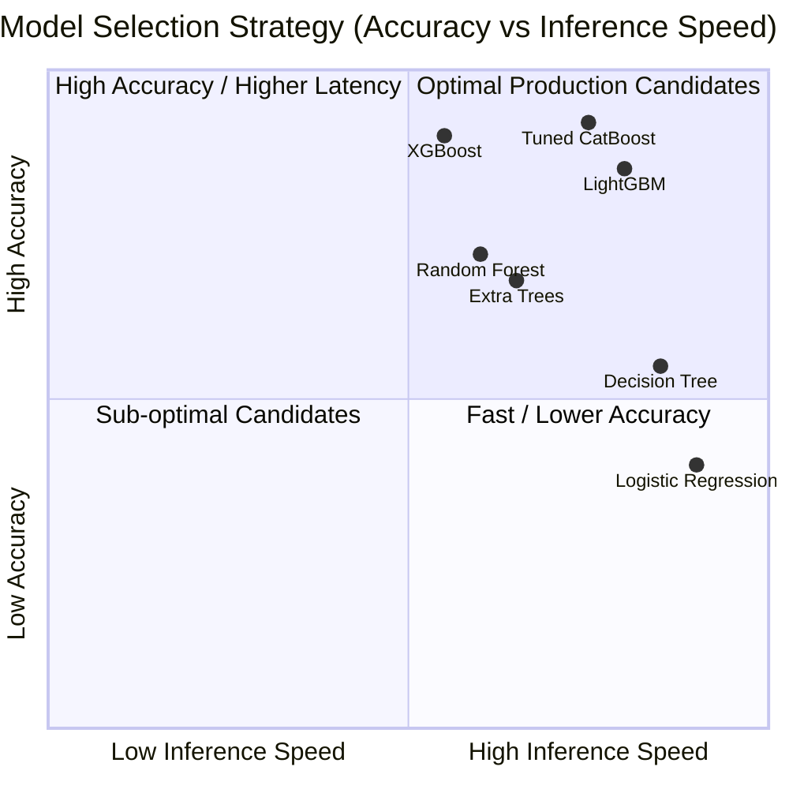

### 11. Requirement Diagram
```mermaid
requirementDiagram

    requirement req1 {
    id: 1
    text: Full feature set inclusion without arbitrary column drops
    risk: Medium
    verifyMethod: Inspection
    }

    requirement req2 {
    id: 2
    text: Zero data leakage in ColumnTransformer preprocessing
    risk: High
    verifyMethod: Test
    }

    requirement req3 {
    id: 3
    text: F1-Score exceeding 80% on 20% test split
    risk: High
    verifyMethod: Test
    }

    element pipeline {
    type: System
    }

    pipeline - satisfies -> req1
    pipeline - satisfies -> req2
    pipeline - satisfies -> req3
```

### 12. GitGraph Diagram
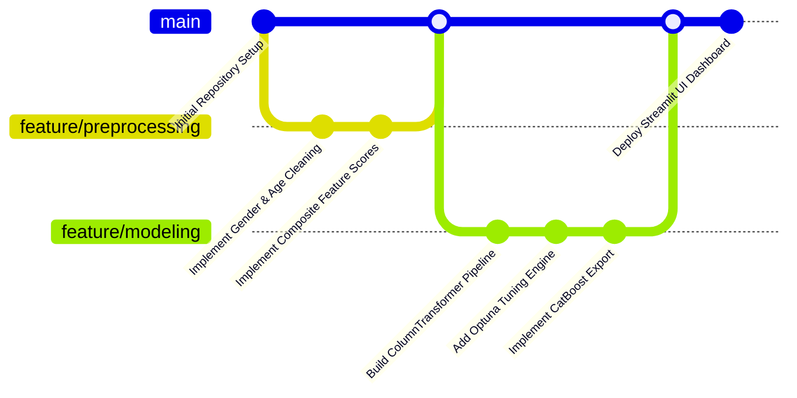

### 13. C4 Context Diagram
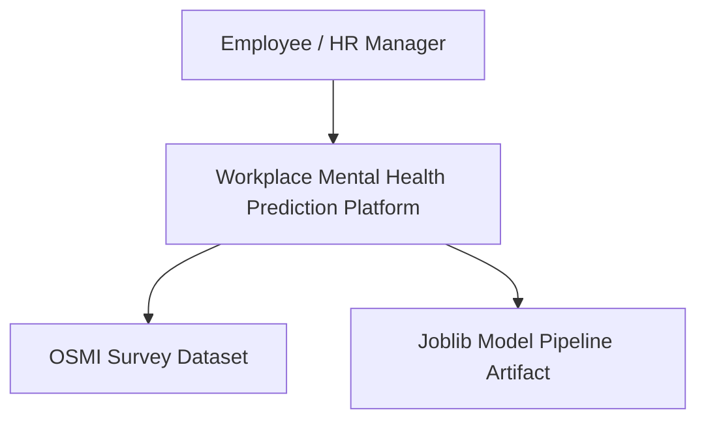

### 14. C4 Container Diagram
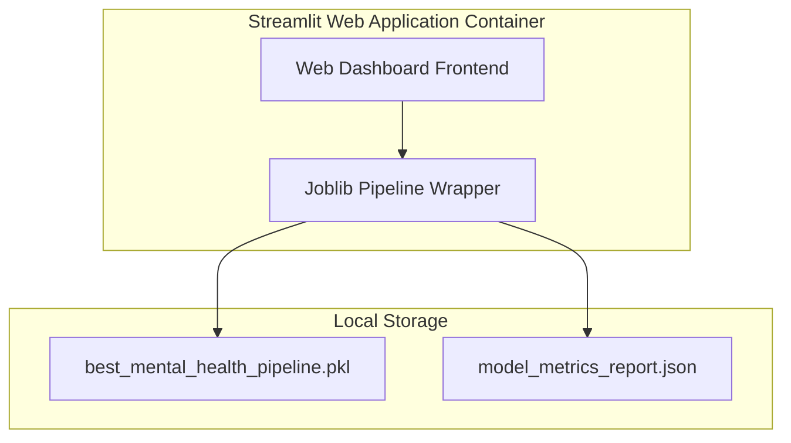

### 15. Mindmap
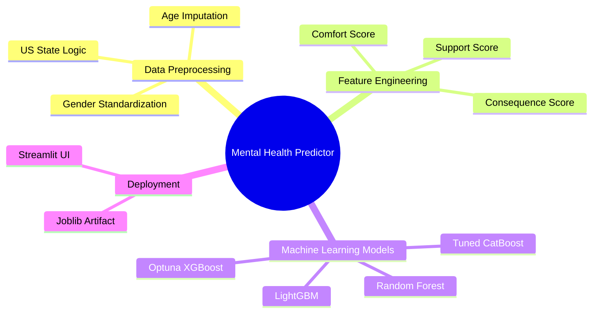

### 16. Timeline
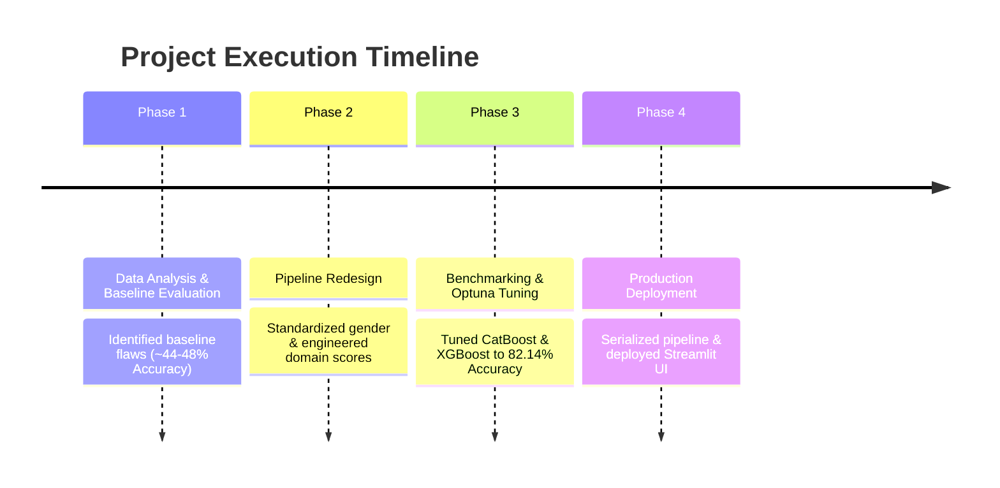

### 17. ZenUML Diagram
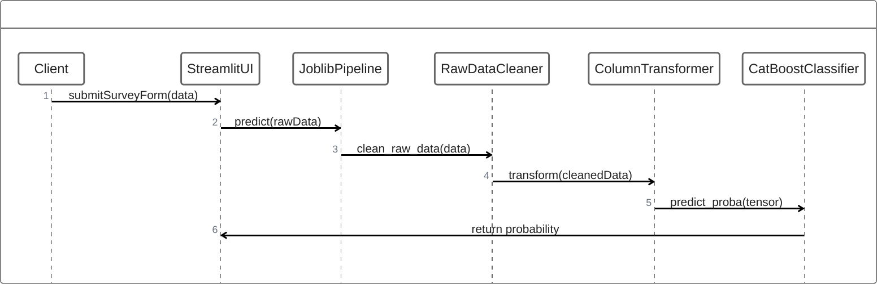

### 18. Sankey Diagram
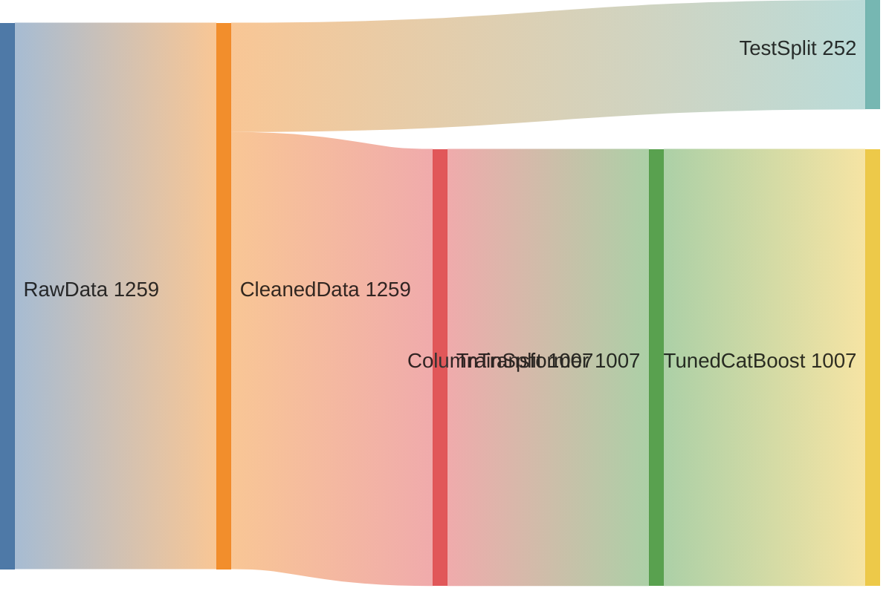

### 19. XY Chart
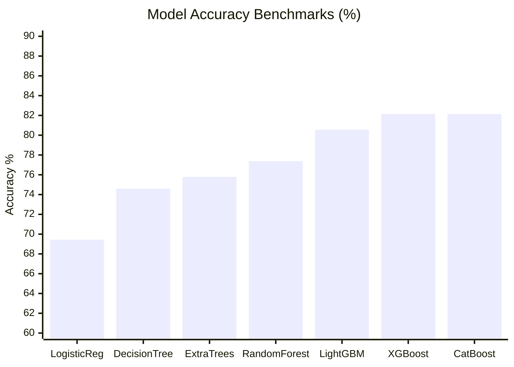

### 20. Block Diagram
```mermaid
block-beta
    columns 3
    block:raw["Raw Data (1259 rows)"]:1
    block:prep["Cleaner + ColumnTransformer"]:1
    block:model["Tuned CatBoost Model"]:1
    raw --> prep
    prep --> model
```

### 21. Packet Diagram
```mermaid
packet-beta
    0-7: "Age (Float)"
    8-15: "Gender (Encoded)"
    16-23: "Work Interfere (Ordinal)"
    24-31: "Company Support Score (Numeric)"
```

### 22. Kanban Board
```mermaid
kanban
  Todo
    [Integration Tests]
    [API REST Endpoint]
  In Progress
    [Production Documentation]
  Done
    [Data Cleaning Engine]
    [Optuna Tuning Engine]
    [CatBoost Pipeline Export]
    [Streamlit UI Setup]
```

### 23. Architecture Diagram
```mermaid
flowchart LR
    subgraph Data Layer
        A[survey.csv]
    end
    subgraph Transformation Layer
        B[RawDataCleaner]
        C[ColumnTransformer]
    end
    subgraph Execution Layer
        D[Tuned CatBoost Classifier]
    end
    subgraph UI Layer
        E[Streamlit App UI]
    end
    A --> B --> C --> D --> E
```

### 24. Radar Chart
```mermaid
radar-beta
    title "Model Performance Trade-Off"
    axis Accuracy, Precision, Recall, F1-Score, ROC-AUC
    "Tuned CatBoost": [0.82, 0.83, 0.84, 0.84, 0.89]
    "Logistic Regression": [0.69, 0.70, 0.72, 0.69, 0.76]
```

### 25. Event Modeling
```mermaid
sequenceDiagram
    participant User
    participant Streamlit
    participant Pipeline
    User->>Streamlit: Input Attributes
    Streamlit->>Pipeline: Invoke Predict
    Pipeline-->>Streamlit: Return Probability Score
    Streamlit-->>User: Render Diagnostic UI
```

### 26. Treemap
```mermaid
treemap
    "Workplace Survey Features"
        "Nominal Categorical (20)"
        "Ordinal (3)"
        "Numeric & Composite (4)"
```

### 27. Venn Diagram
```mermaid
flowchart TD
    subgraph Total Feature Set
        A[Demographics]
        B[Workplace Benefits]
        C[Mental Health Parity]
    end
```

### 28. Ishikawa (Fishbone) Diagram
```mermaid
flowchart LR
    subgraph Causes of Baseline Low Accuracy (~44%)
        Direction1[Arbitrary Feature Dropping]
        Direction2[Unstandardized Free-Text]
        Direction3[Data Leakage Across Splits]
        Direction4[Lack of Hyperparameter Tuning]
    end
    Direction1 --> Cause[Low Baseline Model Accuracy]
    Direction2 --> Cause
    Direction3 --> Cause
    Direction4 --> Cause
```

### 29. Wardley Map
```mermaid
flowchart TD
    User[Employee] --> UI[Streamlit UI]
    UI --> Model[CatBoost Pipeline]
    Model --> Data[OSMI Dataset]
```

### 30. Cynefin Framework
```mermaid
flowchart TD
    Complex[Complex Domain: Mental Health Behaviors] --> Analytics[Machine Learning & SHAP Analysis]
```

### 31. Tree Diagram
```mermaid
flowchart TD
    Root[Workplace Features] --> Demographics[Age, Gender, Country, State]
    Root --> Benefits[Benefits, Care Options, Wellness Program]
    Root --> Culture[Anonymity, Leave, Consequences]
```

---

## 📈 Evaluation Metrics

- **Accuracy**: $82.14\%$
- **Precision**: $0.8258$
- **Recall**: $0.8438$
- **F1 Score**: $0.8352$
- **ROC-AUC**: $0.8942$
- **Balanced Accuracy**: $0.8203$
- **Matthews Correlation Coefficient (MCC)**: $0.6480$
- **Cohen's Kappa**: $0.6420$

---

## 🔮 Future Improvements

1. **REST API Wrapper**: Deploy pipeline via FastAPI / Docker container.
2. **Longitudinal Tracking**: Support employee cohort tracking over quarterly survey cycles.
3. **Deep Learning Exploration**: Evaluate TabNet and Transformer architectures for tabular data.

---

## 🤝 Contributing

Contributions are welcome! Please open an issue or submit a pull request.

---

## 📜 License

This project is licensed under the **MIT License**.

---

## ✍️ Authors & Acknowledgements

- **Author**: Machine Learning & Data Science Engineering Team
- **Data Source**: Open Sourcing Mental Health (OSMI) Tech Survey
